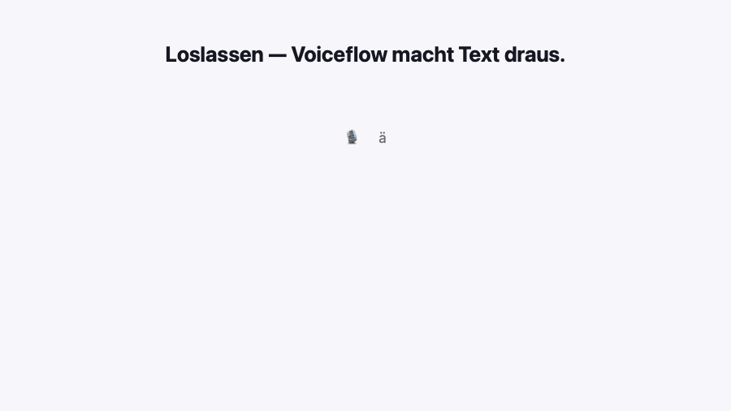
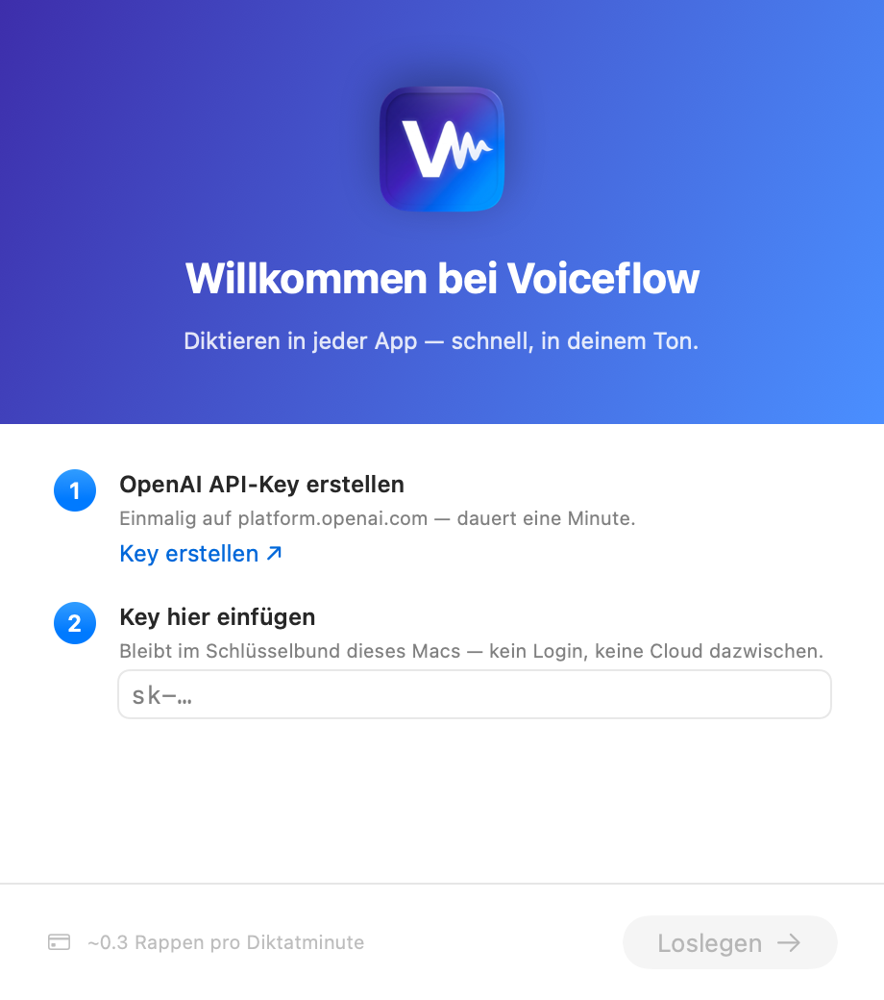
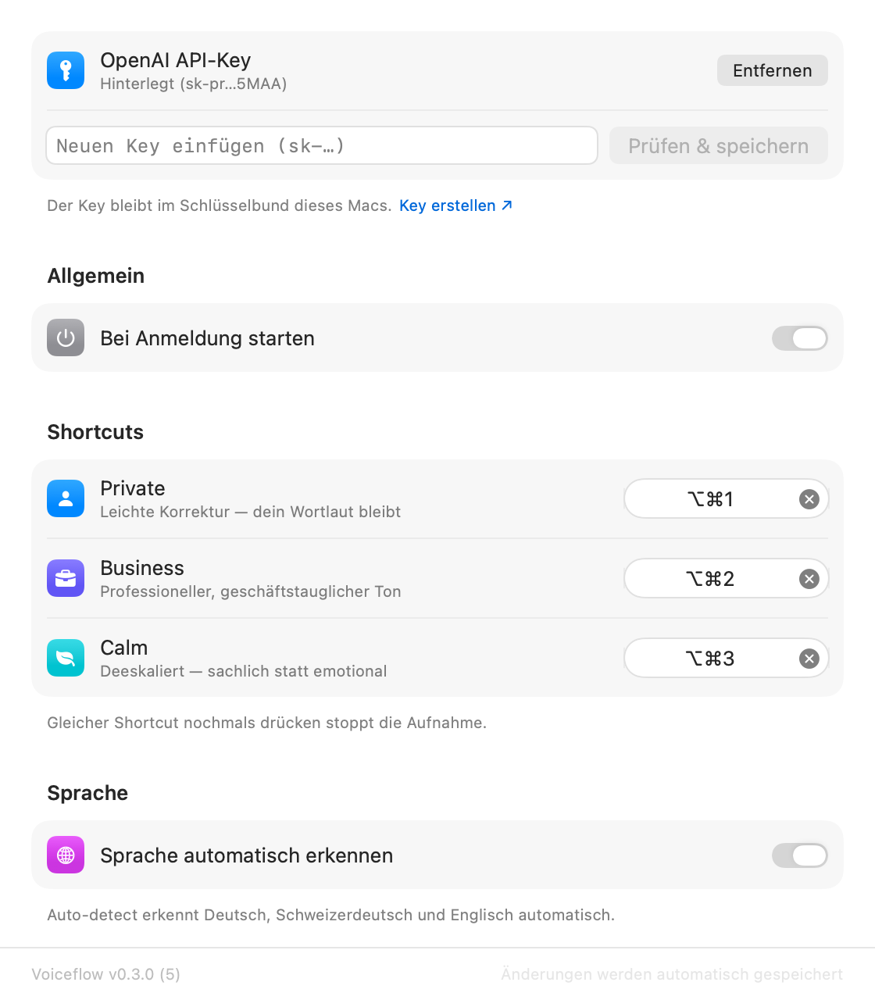
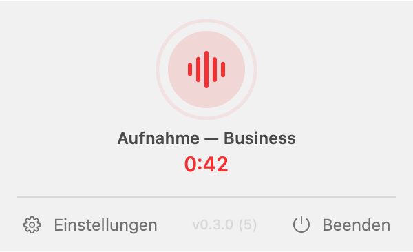

<div align="center">

# 🎙️ Voiceflow

### System-wide dictation for macOS with AI cleanup — bring your own OpenAI key.

Press a shortcut anywhere, speak, press it again — your words land in the active
text field, cleaned up in the tone you chose. No account, no subscription, no
backend in between.



[**⬇ Download for macOS**](https://github.com/tmurschetz/voiceflow/releases/latest) ·
[▶ Watch the 44-second teaser](https://github.com/tmurschetz/voiceflow/releases/latest) ·
[Installation guide](voiceflow-desktop/INSTALL.md)

</div>

---

## What it does

You dictate the way you actually speak — with "ähm", false starts, "no wait, make
that Tuesday" — and Voiceflow returns clean, ready-to-send text right where your
cursor is. It runs as a menu bar app and talks **directly to the OpenAI API with
your own key**, so there's no monthly fee and nothing of yours touches a third
party's server.

```
🎙  "ähm das Meeting morgen äh auf drei – nein, auf vier Uhr verschieben"
                              ↓
✓  "Das Meeting morgen wird auf 16:00 Uhr verschoben."
```

## Features

- **Three modes, each with its own global shortcut and custom instruction**
  - **Privat** — light cleanup: punctuation, filler words removed,
    self-corrections applied, your wording preserved
  - **Business** — polished, professional register (Swiss business German for
    German input, professional English for English)
  - **Random** — *your* rules: drive it with any instruction, e.g.
    *"translate everything to English"*, *"format as a bullet list"*, or
    *"write in Zürich dialect"*
- **Custom instruction per mode** — personalise the output; the instruction is
  applied on every dictation and even controls the output language or dialect
- **Fast** — `gpt-4o-mini-transcribe` (roughly half the price and latency of
  Whisper), 16 kHz speech-optimized recording, and the connection is pre-warmed
  while you speak. A typical dictation is ready in ~2 seconds.
- **Pick your models** — choose the transcription model (GPT-4o mini Transcribe ·
  GPT-4o Transcribe · Whisper) and the text model (GPT-4o mini · GPT-4o), each
  with a plain-language hint about speed, cost and languages
- **Languages** — German, Swiss German dialect (output in Swiss Standard German
  by default, or keep the dialect via a custom instruction) and English, all
  auto-detected. Whisper covers 98 languages for everything else.
- **Du / Sie aware** — mirrors the register you actually spoke
- **Never loses a recording** — transient API failures retry automatically with
  a visible countdown, then fall back to the raw transcript; a failed dictation
  is even rescued so you can retry it from the menu
- **Private by design** — your API key lives in the macOS Keychain, the dictation
  history is stored locally only (optional, deletable), and there is no telemetry.
  A built-in **trace-free uninstall** removes everything in one click.

## A look inside

| Onboarding | Settings | Recording |
|:---:|:---:|:---:|
|  |  |  |

## Install

1. Download the latest `.dmg` from the [**Releases**](https://github.com/tmurschetz/voiceflow/releases/latest)
   page and drag Voiceflow into Applications.
2. First launch: **right-click → Open → Open** (the beta isn't notarized yet).
3. Paste your OpenAI API key into the setup window
   ([create one here](https://platform.openai.com/api-keys)).
4. Record your shortcuts in Settings and grant Microphone + Accessibility.

Full step-by-step guide, including the one-time Keychain prompt:
[INSTALL.md](voiceflow-desktop/INSTALL.md).

**Cost:** roughly **$0.003 per dictation minute**, billed by OpenAI to your own
key. No subscription to Voiceflow.

**Requirements:** macOS 13 (Ventura) or newer.

## How it works

```
Shortcut ▸ record  →  OpenAI transcription  →  AI cleanup in your chosen tone  →  inserted at your cursor
```

Everything runs on your Mac and your OpenAI key. The two steps are independent and
each retries on a hiccup, so a flaky moment never costs you a dictation.

## Building from source

Requirements: Xcode 15+, [XcodeGen](https://github.com/yonaskolb/XcodeGen)
(`brew install xcodegen`).

```sh
make install        # build a Release .app, install to /Applications, launch
make dmg            # build the distributable DMG
make icon           # regenerate the app icon + menu bar template from AppIcon.png
make release-notes  # update CHANGELOG.md from git history
```

Handy developer entry points:

```sh
# Render the promo video / demo GIF entirely in code (no screen recording)
swift scripts/promo-video.swift out.mp4
swift scripts/promo-video.swift out.gif

# Run the functional self-test against the real pipeline
Voiceflow --selftest path/to/german-clip.m4a
```

## Known limitations (beta)

- **Ad-hoc signed** — the first launch needs right-click → Open, and the Keychain
  asks once ("Always Allow"). A Developer ID + notarization will remove both.
- **No auto-update yet** — new versions ship as DMGs on the Releases page
  (Sparkle is wired up, pending the Developer ID).

## License

Private project — all rights reserved.

<div align="center">
<sub>Built with Claude Code. Even the promo video and this demo GIF are rendered from code.</sub>
</div>
