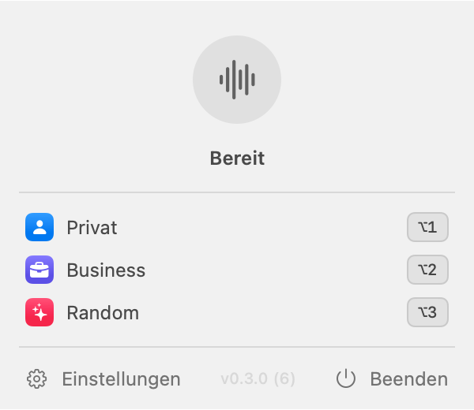

# Voiceflow

**System-wide dictation for macOS with AI cleanup — bring your own OpenAI key.**

Press a shortcut anywhere, speak, press it again: your words land in the active
text field, cleaned up in the tone you chose. No account, no backend, no
subscription — the app talks directly to the OpenAI API with your own key.



## Features

- **Three modes, each with a global shortcut and a custom instruction:**
  - **Privat** — light cleanup: punctuation, fillers removed, self-corrections
    applied, your wording preserved
  - **Business** — polished professional register (Swiss business German for
    German input, professional English for English input)
  - **Random** — your rules: drive it with any instruction, e.g.
    *"Translate everything to English"* or *"Format as a bullet list"*
- **Fast:** `gpt-4o-mini-transcribe` (~half the price and latency of Whisper),
  16 kHz speech-optimized recording, TLS connection pre-warming while you speak
- **Model choice with plain-language guidance** — switch transcription
  (GPT-4o mini Transcribe / GPT-4o Transcribe / Whisper) and text models
  (GPT-4o mini / GPT-4o) in Settings
- **Language support:** German, Swiss German dialect (output in Swiss Standard
  German), English — auto-detected. Whisper option covers 98 languages.
- **Du/Sie aware:** mirrors the register you actually spoke
- **Never lose a dictation:** transient API failures retry with a visible
  countdown, then fall back to the raw transcript
- **Private by design:** API key in the macOS Keychain, dictation history
  stored locally only (optional, deletable), no telemetry
- **Trace-free uninstall** built into Settings — removes key, settings,
  history, permissions, and the app itself

## Install

See **[INSTALL.md](INSTALL.md)** — short version:

1. Download the DMG from [Releases](https://github.com/tmurschetz/voiceflow/releases),
   drag Voiceflow into Applications
2. First launch: right-click → Open → Open (unsigned beta build)
3. Paste your OpenAI API key into the setup window
   ([create one here](https://platform.openai.com/api-keys))
4. Record your shortcuts in Settings, grant Microphone + Accessibility

Cost: roughly **$0.003 per dictation minute** billed by OpenAI to your key.

## Building from source

Requirements: Xcode 15+, [XcodeGen](https://github.com/yonaskolb/XcodeGen) (`brew install xcodegen`).

```sh
make install        # build Release + install to /Applications + launch
make dmg            # build the distributable DMG
make icon           # regenerate AppIcon.icns + menu bar template from AppIcon.png
make release-notes  # update CHANGELOG.md from git history
```

The repo is a standard SwiftUI/AppKit app:

```
VoiceflowDesktop/
├── App/             AppDelegate (pipeline orchestration), snapshot harness
├── Core/
│   ├── OpenAI/      OpenAIClient — the app's entire network layer
│   ├── Recording/   AVAudioRecorder/AVAudioEngine capture (16 kHz AAC)
│   ├── Transcription/ + Processing/   the two pipeline stages
│   ├── Settings/    local settings + model catalogues
│   ├── Logging/     local JSONL history
│   └── Uninstaller  trace-free removal
├── Features/        Menu bar, status panel, settings, onboarding (SwiftUI)
├── Permissions/     mic + accessibility flow
└── Shortcuts/       global hotkeys (sindresorhus/KeyboardShortcuts)
```

### UI snapshot harness

`Voiceflow --snapshot <dir>` renders every screen (onboarding, settings,
all status-panel states) to PNG via off-screen windows — no screen-recording
permission needed. Current renders live in [docs/ui/](docs/ui/).

## Known limitations (beta)

- **Ad-hoc signed** — first launch needs right-click → Open; the Keychain
  asks once per build ("Always Allow"). A Developer ID + notarization will
  remove both (requires Apple Developer Program).
- **No auto-update yet** — new versions ship as DMGs on the Releases page
  (Sparkle is prepared but needs the Developer ID).

## License

Private project — all rights reserved.
